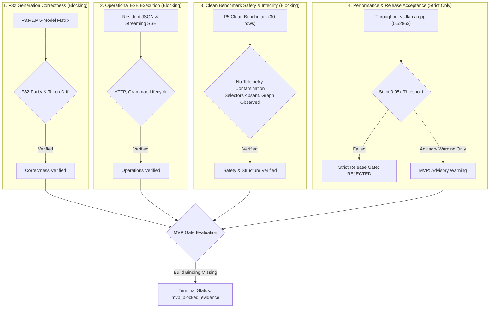

# 🎯 Titan — Stable Functional MVP Specification & Acceptance Contract

> **Canonical Specification:** [`openspec/changes/2026-09-11-stable-functional-mvp/`](../openspec/changes/2026-09-11-stable-functional-mvp/)
> **Constitutional Invariants:** [`openspec/constitution.md`](../openspec/constitution.md)
> **Workspace State:** [`docs/WORKSPACE_STATE.md`](WORKSPACE_STATE.md)
> **Strict Production Envelope:** [`docs/RELEASE_ENVELOPE_V1.json`](RELEASE_ENVELOPE_V1.json)

---

## 🛑 Current Status Block

| Dimension | Current Value | Authority / Artifact |
| :--- | :--- | :--- |
| **Functional MVP Status** | **`mvp_blocked_evidence`** (NOT accepted) | `local-artifacts/reviews/mvp-decision-20260911T162326Z.json` |
| **Strict Production Release Gate** | **`not_accepted`** / **`rejected`** | `local-artifacts/reviews/p5-release-gate-20260912T130000Z.json` |
| **Release Approval** | **`not_granted`** | `docs/RELEASE_ENVELOPE_V1.json` |
| **Production Promotion** | **`promotion_authorized = false`** | `mvp_decision` / `release_envelope` |
| **Default Runtime Dispatch** | **`production_dispatch_changed = false`** | Unchanged F32 resident baseline |
| **Release Candidate Generation** | **`rc_generated = false`** | No RC generated |
| **MVP Gate Unit Suite** | **`25 passed, 0 failed`** (100%) | `uv run --project tools --no-sync pytest tools/test_mvp_gate.py` |
| **Full Python Tooling Suite** | **`88 passed, 0 failed; 8 subtests passed`** (100%) | `uv run --project tools --no-sync pytest tools` |
| **OpenSpec Validation** | **`40 passed, 0 failed`** (40 items) | `openspec validate --all` |
| **Hardware / OS Runner** | NVIDIA GeForce RTX 3060 Laptop GPU / Windows 11 | Ampere CC 8.6, CUDA 12.4, MSVC/NVRTC |

> [!IMPORTANT]
> **Performance Parity Boundary:** A throughput ratio of $\ge 0.95\times$ compared to `llama.cpp` is **NOT** an acceptance criterion for the Stable Functional MVP. The $0.95\times$ threshold is exclusively a strict production-performance diagnostic enforced by `tools/release_gate.py`.
>
> In the functional MVP evaluation, throughput ratios and baseline regression are treated as **advisory warnings** (`ratio_advisory: advisory_warning`, `regression_advisory: failed`). They do not block MVP acceptance.
>
> Conversely, **generation correctness, operational E2E verification, and clean benchmark execution safety remain strictly blocking**.

---

## 1. Why the MVP is Currently Blocked (`mvp_blocked_evidence`)

The current live run passes 88 full-suite tests plus 8 subtests. The earlier MVP execution record retained in the research log reported 84 tests; it is historical, not the current count.

The functional MVP gate failed closed and recorded terminal status `mvp_blocked_evidence` in `local-artifacts/reviews/mvp-decision-20260911T162326Z.json` due to two precise evidence-binding gaps:

1. **`build_binding_unverified` (F8-to-Final-Titan-Build/Source Binding Not Proven):**
   * The independent five-model F32 correctness run (F8.R1.P in `local-artifacts/reviews/f32-five-model-correctness-matrix-1789097311038-15004.json`) proves model numerical correctness and token generation, but its execution record and raw logs do **not** record the Titan binary hash or Git source commit.
   * The P5 clean benchmark (`local-artifacts/benchmarks/p5-final-clean-20260911T151844Z.json`) records Titan build hash `sha256:bc92211356bb0eb87ddd59e252d9d4497f8669d7257ac0133459040ce4eb131c`.
   * Because correctness cannot be mathematically transferred across an unproven or untracked binary, the binding is classified as `not_proven` / `blocked` in `local-artifacts/reviews/mvp-correctness-binding-20260911T162326Z.json`.
2. **`model_hash_missing` (P5 Benchmark Lacks Per-Result Model Hashes):**
   * While the clean benchmark artifact contains 30 valid rows across five models, three repetitions, and cold/warm conditions, its result rows record model names (e.g. `"Qwen 2.5 1.5B Instruct"`) and prompt schemas, but omit the SHA-256 hash of the model weight file (`benchmark_hash = null`).
   * The MVP gate enforces that model identities must match exactly by both file name and SHA-256 between correctness evidence and benchmark throughput evidence.

Because Titan follows a strict fail-closed contract, missing provenance cannot be bypassed or assumed from dirty-tree HEAD.

---

## 2. Decoupled Architecture & Four Independent Decisions

The Titan engineering replan (`.hermes/plans/2026-09-11_155205-titan-stable-mvp-replan.md`) establishes four strictly decoupled decisions:



1. **F32 Generation Correctness (Blocking):** Proves that Titan generates correct tokens on all five allowlisted models with zero unverified kernel drift, batch size 1, resident KV cache, and CUDA Graphs disabled.
2. **Operational E2E Behavior (Blocking):** Proves real server lifecycle, OpenAI-compatible HTTP endpoints (`/v1/chat/completions`), SSE token streaming, speculative N-gram mode, grammar-constrained JSON decoding, bounded readiness, and graceful shutdown.
3. **Clean Benchmark & Evidence Safety (Blocking):** Proves that throughput measurements are collected in pure `instrumentation_mode = "clean_throughput"` without diagnostic telemetry contamination, with observed Graph disabled, candidate selectors absent, and intact summary statistics.
4. **Production Performance Acceptance (Advisory for MVP, Strict for Production):** Evaluates whether Titan reaches $\ge 0.95\times$ of `llama.cpp` throughput. In the strict gate, Titan is rejected (`0.5286x` aggregate). In the MVP gate, this is strictly advisory.

---

## 3. MVP Acceptance Contract & Vocabulary

The MVP gate (`tools/mvp_gate.py`) enforces the following explicit terminal vocabulary:

| Terminal Status | Meaning | Exit Code |
| :--- | :--- | :---: |
| `mvp_accepted_functional` | All blocking functional gates passed; no material performance warnings. | `0` |
| `mvp_accepted_with_performance_advisory` | All blocking functional gates passed; advisory ratio/regression warnings present. | `0` |
| `mvp_blocked_correctness` | F8 correctness verification failed, model hash mismatched, or tokens diverged. | `1` |
| `mvp_blocked_operational` | Required operational case failed, was skipped, timed out, or had malformed output. | `1` |
| `mvp_blocked_evidence` | Build-binding unproven, benchmark structure invalid, or safety violation detected. | `1` |
| `mvp_not_exercised` | Prerequisites were not executed or inputs were missing. | `1` |

### Explicit Advisory Allowlist

Only failures explicitly matching the following allowlist may be downgraded from blocking to advisory warnings:
* `per_model_ratio`
* `aggregate_ratio`
* `regression`
* `regression_failed`
* `regression_not_evaluated`
* `regression_incomparable`
* `unstable_reference`
* `ffn_sync_unavailable`
* `ffn_sync_missing_frontier`
* `asymmetric_reference_stage_coverage`
* `nsight_counters_blocked`
* `causal_frontier_diagnostic_incomplete`

**Any failure not on this list immediately blocks the MVP.**

---

## 4. Evidence Matrix & Verified Facts

### 4.1 Verified Evidence Inventory

| Category | Item | Verified Fact / Metric | Canonical Artifact |
| :--- | :--- | :--- | :--- |
| **Correctness** | 5-Model F32 Matrix | 5/5 models verified; F32, batch 1, resident KV, Graph=false, candidate selectors absent | `local-artifacts/reviews/f32-five-model-correctness-matrix-1789097311038-15004.json` (SHA-256 `4e1d5571...`) |
| **Operational** | Resident Mode | HTTP JSON `/v1/chat/completions` executed and verified | `local-artifacts/reviews/p5o-e2e-unified-modes-20260912T090000Z.log` |
| **Operational** | Streaming SSE | SSE chunks verified with speculative N-gram acceleration | `local-artifacts/reviews/p5o-e2e-unified-modes-20260912T090000Z.log` |
| **Operational** | Grammar JSON | Real GPU execution produced valid JSON semantically parsed by serde as `{"city": "Tokyo"}` | `local-artifacts/reviews/p5o-grammar-json-20260912T100000Z.log` (SHA-256 `21dfb35a...`) |
| **Operational** | Lifecycle | Readiness probe, bounded timeout, graceful cleanup, and negative rejection verified | `local-artifacts/reviews/f2-unified-modes-lifecycle-contract-20260911T024000Z.log` |
| **Benchmark** | Clean Benchmark Rows | 30 rows (5 models × 3 repetitions × cold/warm), 41 tokens/sample, clean mode | `local-artifacts/benchmarks/p5-final-clean-20260911T151844Z.json` (SHA-256 `5a91ac8a...`) |
| **Safety** | Clean Telemetry | Recursive absence of `telemetry`, `dispatch_telemetry`, and stage timings verified | `p5-final-clean-20260911T151844Z.json` |
| **Safety** | Selector Provenance | `candidate_selectors_absent = true`, `active_candidate_selectors = []`, `production_dispatch_changed = false` | `p5-final-clean-20260911T151844Z.json` |
| **Tooling** | MVP Unit Tests | 25 passed, 0 failed | `tools/test_mvp_gate.py` |
| **Tooling** | Full Python Suite | 88 passed, 0 failed; 8 subtests passed | `tools/test_*.py` |
| **Tooling** | OpenSpec | 40 passed, 0 failed (40 items) | `openspec validate --all` |
| **Performance** | Strict Gate Diagnostic | Aggregate ratio `0.5286115177544821` (cold `0.5758x`, warm `0.4981x`); regression failed | `local-artifacts/reviews/p5-release-gate-20260912T130000Z.json` |

### 4.2 Five Allowlisted Models

| Model Name | Standard GGUF File Path | Model SHA-256 Hash |
| :--- | :--- | :--- |
| **Qwen 2.5 1.5B Instruct** | `models/qwen2.5-1.5b-instruct-q4_k_m.gguf` | `6a1a2eb6d15622bf3c96857206351ba97e1af16c30d7a74ee38970e434e9407e` |
| **Llama 3.2 1B Instruct** | `models/Llama-3.2-1B-Instruct-Q4_K_M.gguf` | `6f85a640a97cf2bf5b8e764087b1e83da0fdb51d7c9fab7d0fece9385611df83` |
| **Llama 3.2 3B Instruct** | `models/Llama-3.2-3B-Instruct-Q4_K_M.gguf` | `6c1a2b41161032677be168d354123594c0e6e67d2b9227c84f296ad037c728ff` |
| **DeepSeek-R1-Distill 1.5B**| `models/DeepSeek-R1-Distill-Qwen-1.5B-Q4_K_M.gguf` | `1741e5b2d062b07acf048bf0d2c514dadf2a48f94e2b4aa0cfe069af3838ee2f` |
| **Qwen3 0.6B Base/Chat** | `testdata/Qwen3-0.6B-Q4_K_M.gguf` | `ac2d97712095a558e31573f62f466a3f9d93990898b0ec79d7c974c1780d524a` |

---

## 5. Reproduction Commands

All commands use Windows native paths and UV (`uv run --project tools --no-sync`).

### 5.1 Run the Functional MVP Gate

```powershell
uv run --project tools --no-sync python -B tools/mvp_gate.py `
  --benchmark C:/Users/niber/AppData/Local/hermes/workspace/titan/local-artifacts/benchmarks/p5-final-clean-20260911T151844Z.json `
  --correctness-evidence C:/Users/niber/AppData/Local/hermes/workspace/titan/local-artifacts/reviews/f32-five-model-correctness-matrix-1789097311038-15004.json `
  --correctness-sha256 4e1d5571181ca782d32f5fe20c39f1bc8ad06c275c9009496927320cb833d111 `
  --correctness-binding C:/Users/niber/AppData/Local/hermes/workspace/titan/local-artifacts/reviews/mvp-correctness-binding-20260911T162326Z.json `
  --operational-evidence C:/Users/niber/AppData/Local/hermes/workspace/titan/local-artifacts/reviews/mvp-operational-evidence-20260911T162326Z.json `
  --regression-baseline C:/Users/niber/AppData/Local/hermes/workspace/titan/local-artifacts/benchmarks/p2-clean-baseline-20260911T150447Z-aligned.json `
  --output C:/Users/niber/AppData/Local/hermes/workspace/titan/local-artifacts/reviews/mvp-decision-20260911T162326Z.json
```

### 5.2 Run MVP Gate Unit Tests

```powershell
uv run --project tools --no-sync pytest tools/test_mvp_gate.py -v
```

### 5.3 Run Full Python Verification Suite

```powershell
uv run --project tools --no-sync pytest tools -v
```

### 5.4 Validate OpenSpec Changes

```powershell
openspec validate --all
```

---

## 6. Local-Only Evidence & Non-Publishable Content

> [!WARNING]
> The following directories contain purely local, ephemeral, or diagnostic artifacts and are **NOT** publishable repository content:
> * `local-artifacts/` — Raw execution logs, Nsight profiles, benchmark runs, decision manifests, and intermediate build tools.
> * `.hermes/` — Agent planning documents, scratch execution notes, and task replans.
> * `models/` & `testdata/*.gguf` — Proprietary or third-party binary model weights.
> * `target/` & `engine/target/` — Compiled Rust binaries, object files, and incremental compilation caches.
>
> Repository-facing documentation MUST link to reproducible concepts, specs, and checked-in tools, while accurately citing local artifact paths as historical provenance without attempting to commit or stage them.

---

## 7. Known Limitations & Deferred Workstreams

1. **Production Performance (0.95x Threshold):** Titan's current aggregate throughput is $\sim 0.53\times$ of `llama.cpp` on the RTX 3060 reference environment. Gap closure remains a deferred track.
2. **Q8 Quantization:** The Q8 activation quantizer is numerically verified in isolated layer tests, but the full-driver Q8 runtime contract remains experimental and unpromoted. F32 is the sole production default.
3. **Causal Attribution (`ffn_sync`):** Inter-kernel synchronization timing (`ffn_sync`) is classified as `not_available / missing_real_frontier` due to lack of a hardware barrier event. Full-loop Amdahl claims are deferred.
4. **Hardware Profiling:** GPU performance counter collection via NVIDIA Nsight Compute is blocked on Windows by `ERR_NVGPUCTRPERM`.
5. **Advanced Engine Capabilities:** Features such as continuous batching, multi-model speculative decoding, layer streaming, attention sinks, and prefix caching exist in the codebase but are **not** all certified as production defaults under the single-sequence F32 envelope.

---

## 8. Smallest Next Gate to Unblock MVP

To transition the MVP status from `mvp_blocked_evidence` to `mvp_accepted_with_performance_advisory`:

1. **Emit Per-Result Model Hashes:** Update the benchmark producer in `engine/engine-server/tests/multi_model_comparison_bench.rs` to serialize the SHA-256 hash of each GGUF file in every benchmark result record.
2. **Bind Titan Build Identity in F8:** Run or bind the F8 correctness verification with an explicit recording of the Titan binary SHA-256 and Git source commit hash.
3. **Re-evaluate MVP Gate:** Run `tools/mvp_gate.py` with the newly paired evidence, generating a green `mvp_accepted_with_performance_advisory` verdict while keeping `promotion_authorized = false` and `rc_generated = false`.
