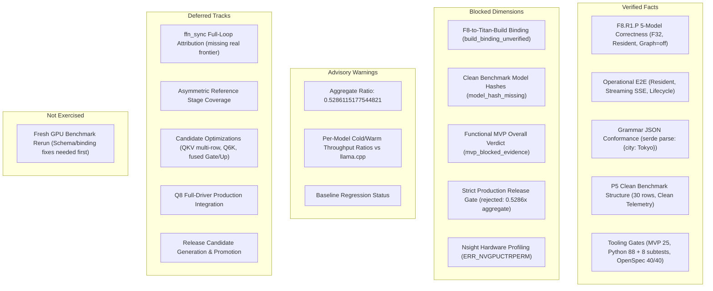

# Titan — Workspace State and Organization

**Audit Cut:** 2026-09-11
**Branch:** `master`
**Audited HEAD:** `e15fa907f0ccad0aee75b4ac85d0ec08411fb675` (`master...origin/master`)
**Workspace Root:** `C:/Users/niber/AppData/Local/hermes/workspace/titan`
**State:** Local checkout intentionally dirty; preserved without commit, stash, or push.

---

## 🛑 Current Status & Execution Boundary

| Dimension | Current Value | Authority / Artifact |
| :--- | :--- | :--- |
| **Functional MVP Status** | **`mvp_blocked_evidence`** (NOT accepted) | [`local-artifacts/reviews/mvp-decision-20260911T162326Z.json`](MVP.md) |
| **Strict Production Release** | **`not_accepted`** / **`rejected`** | `local-artifacts/reviews/p5-release-gate-20260912T130000Z.json` |
| **Release Approval** | **`not_granted`** | [`docs/RELEASE_ENVELOPE_V1.json`](RELEASE_ENVELOPE_V1.json) |
| **Production Promotion** | **`promotion_authorized = false`** | No candidate promoted to default |
| **Default Runtime Dispatch** | **`production_dispatch_changed = false`** | Verified default F32 resident baseline |
| **Release Candidate Generation** | **`rc_generated = false`** | No release candidate generated |
| **MVP Gate Unit Suite** | **`25 passed, 0 failed`** (100%) | `uv run --project tools --no-sync pytest tools/test_mvp_gate.py` |
| **Full Python Tooling Suite** | **`88 passed, 0 failed; 8 subtests passed`** (100%) | `uv run --project tools --no-sync pytest tools` |
| **OpenSpec Live State** | **`40 passed, 0 failed`** (40 items) | `openspec validate --all` |
| **Stable Functional MVP Guide** | See [`docs/MVP.md`](MVP.md) | Full contract, reproduction, and blockers |

> [!IMPORTANT]
> **Functional MVP vs. Strict Production Gate:**
> * A throughput ratio of $\ge 0.95\times$ compared to `llama.cpp` is **NOT** an acceptance criterion for the Stable Functional MVP. The $0.95\times$ comparison remains a separate strict production-performance diagnostic enforced by `tools/release_gate.py`.
> * In the functional MVP evaluation, throughput ratios (aggregate median `0.5286115177544821`, cold `0.5758x`, warm `0.4981x`) and baseline regressions are advisory warnings (`ratio_advisory: advisory_warning`, `regression_advisory: failed`).
> * Conversely, **generation correctness, operational E2E execution, and clean benchmark execution safety remain strictly blocking**.
>
> **Exact MVP Blockers:**
> 1. **`build_binding_unverified`:** The independent F32 correctness run (F8.R1.P) verified model accuracy across 5 models, but does not record the Titan binary or source identity matching the clean benchmark's `engine_identity.titan` build hash (`sha256:bc92211356bb0eb87ddd59e252d9d4497f8669d7257ac0133459040ce4eb131c`).
> 2. **`model_hash_missing`:** The final clean benchmark artifact (`local-artifacts/benchmarks/p5-final-clean-20260911T151844Z.json`, 30 rows) records model names but lacks per-result GGUF weight file hashes required for exact binding to F8.
>
> **Local-Only Evidence & Publishing Boundary:**
> Directories such as `local-artifacts/`, `.hermes/`, `models/`, and `target/` contain local execution logs, private model weights, and compiler targets. They are **not** publishable repository content. Advanced features (speculative decoding, layer streaming, APC, attention sinks) exist in the codebase but are **not** all production-integrated or certified under the release envelope.

---

## 1. Ground Truth & Principles

This document summarizes the current operational and verification state of the repository. Performance and correctness claims are valid only when they point directly to a concrete JSON artifact or raw log under `local-artifacts/`. README tables and historical notes do not replace or override primary execution evidence.

---

## 2. Architectural Planes & Operational State

| Architectural Plane | Scope & Responsibility | Current Status |
| :--- | :--- | :--- |
| **Ingestion / Representation** | GGUF v3 parser, metadata, tensor loading, tokenizer, format layout. | Implemented; Q8 activation quantization requires an explicit full-driver contract. |
| **GPU / CPU / Memory Execution** | CUDA kernels, GEMV/GEMM, attention, KV-cache allocation. | Q6_K ABI repaired; GPU test gates green; F32 batch=1 resident-KV is the active route. |
| **Runtime / Generation / Scheduling** | `ForwardDriver`, Graph capture, dynamic scheduling, token decoding. | F32 operational default; Q8 experimental; default dispatch strictly unchanged (`production_dispatch_changed = false`). |
| **Server / API / CLI** | Axum HTTP daemon, SSE streaming, JSON chat completions, terminal CLI. | E2E verified on GPU; grammar-constrained JSON parsed semantically as `{"city": "Tokyo"}`. |
| **Evidence / Observability / Release** | Telemetry, benchmarks, gate validators, OpenSpec changes. | Functional MVP evaluated as `mvp_blocked_evidence`; strict release gate `rejected` (`0.5286x` aggregate). |

---

## 3. Evidence Taxonomy & Current Status Classification

Every dimension of the engine is classified into one of five explicit statuses:



### 3.1 Verified Facts
- **Generation Correctness:** `local-artifacts/reviews/f32-five-model-correctness-matrix-1789097311038-15004.json` independently verified 5/5 models on F32, batch 1, resident KV, Graph=false, candidate selectors absent; `production_dispatch_changed = false`.
- **Operational E2E:** `local-artifacts/reviews/p5o-e2e-unified-modes-20260912T090000Z.log` verified Resident JSON and Streaming SSE with speculative N-gram mode over HTTP `/v1/chat/completions`.
- **Grammar Constrained JSON:** `local-artifacts/reviews/p5o-grammar-json-20260912T100000Z.log` verified token-by-token RFC 8259 masking and serde deserialization to exact JSON: `{"city": "Tokyo"}`.
- **Clean Benchmark Structure:** `local-artifacts/benchmarks/p5-final-clean-20260911T151844Z.json` contains 30 valid rows (5 models × 3 repetitions × cold/warm), 41 tokens/sample, observed Graph disabled, and clean telemetry.
- **Tooling Suites:** MVP unit suite passes 25/25 (`tools/test_mvp_gate.py`); current full Python suite passes 88 tests plus 8 subtests (the earlier MVP execution record reported 84); OpenSpec passes 40/40 (`openspec validate --all`).

### 3.2 Blocked Dimensions
- **F8-to-Build Binding:** `build_binding_unverified` — F8 raw and runner logs do not record the Titan binary SHA-256 or Git source commit matching the benchmark's `engine_identity.titan` build hash (`sha256:bc92211356bb0eb87ddd59e252d9d4497f8669d7257ac0133459040ce4eb131c`).
- **Benchmark Model Hashes:** `model_hash_missing` — `p5-final-clean-20260911T151844Z.json` omits per-result GGUF weight file hashes required for exact model-identity binding to F8.
- **Functional MVP Verdict:** `mvp_blocked_evidence` in `local-artifacts/reviews/mvp-decision-20260911T162326Z.json`.
- **Strict Release Gate:** Status `rejected` in `local-artifacts/reviews/p5-release-gate-20260912T130000Z.json` due to aggregate ratio `0.5286115177544821` and regression failure.
- **Nsight Profiling:** Blocked on Windows by driver permission `ERR_NVGPUCTRPERM`.

### 3.3 Advisory Dimensions (Non-blocking for MVP)
- **Titan/llama.cpp Aggregate Ratio:** `0.5286115177544821` (cold `0.5758494419340426`, warm `0.4980834957173451`).
- **Per-Model Ratios:** Qwen 2.5 1.5B (cold 0.5758x / warm 0.4822x), Llama 3.2 1B (cold 0.4987x / warm 0.4410x), Llama 3.2 3B (cold 5.6335x / warm 3.8832x), DeepSeek-R1-Distill 1.5B (cold 0.5498x / warm 0.5075x), Qwen3 0.6B (cold 0.7317x / warm 0.4981x).
- **Regression Evaluation:** Status `failed` relative to baseline.

### 3.4 Deferred Tracks
- **`ffn_sync` Attribution:** Classified as `not_available / missing_real_frontier`. Full-loop Amdahl claims are deferred.
- **Candidate Optimizations:** `q4k_multi_shape_single_row` remains accepted opt-in only; QKV multi-row batch 1 remains rejected regression; fused Gate/Up and Q6_K single-row remain rejected.
- **Production Integration:** Release candidate generation (`rc_generated = false`), production promotion (`promotion_authorized = false`), and release approval (`release_approval = not_granted`).

### 3.5 Not Exercised
- **Fresh GPU Benchmark Rerun:** Re-running the same benchmark on GPU without modifying the producer to emit model hashes would yield identical schema failures. Fresh execution is deferred until producer alignment is implemented.

---

## 4. Workspace Organization & Evidence Boundaries

```text
titan/
├── engine/                      # Pure Rust engine crates and CUDA kernel sources
│   ├── engine-api/              # Public traits, types, and telemetry contracts
│   ├── engine-io/               # GGUF v3 parser, tensor memory loader
│   ├── engine-cuda/             # NVRTC runtime JIT, DP4A GEMV, PagedAttention
│   ├── engine-kvcache/          # Virtual block table, page pool allocator
│   ├── engine-core/             # ForwardDriver, sampler, speculative engine
│   └── engine-server/           # HTTP Axum daemon, SSE streaming, CLI binaries
├── openspec/                    # OpenSpec specifications and active changes
│   ├── specs/                   # Canonical architectural specifications
│   └── changes/                 # Active, completed, and archived change proposals
├── docs/                        # Repository-facing documentation
│   ├── MVP.md                   # Stable Functional MVP contract & reproduction
│   ├── WORKSPACE_STATE.md       # Operational state, evidence, and audit cut
│   ├── ARCHITECTURE.md          # Deep technical engine architecture
│   ├── BENCHMARKS.md            # Empirical performance evaluation and historical data
│   ├── TESTING.md               # Test execution strategy and reproduction commands
│   ├── RELEASE_ENVELOPE_V1.json # Strict production envelope specification
│   └── TITAN_PROJECT_DIAGNOSIS_AND_ROADMAP.md # Engineering diagnosis & roadmap
├── tools/                       # Python tooling, gate validators, and test suites
│   ├── mvp_gate.py              # Functional MVP gate validator
│   ├── test_mvp_gate.py         # Functional MVP unit test suite (25 tests)
│   ├── release_gate.py          # Strict production release gate validator
│   └── test_release_gate.py     # Strict release gate unit test suite (55 tests)
├── local-artifacts/             # [LOCAL ONLY - NOT PUBLISHABLE] Execution logs, runs, decisions
│   ├── benchmarks/              # Raw and parsed benchmark JSON artifacts
│   ├── reviews/                 # Gate decisions, evidence manifests, raw logs
│   ├── bundles/                 # Packaged verification and blocker bundles
│   └── llama-build-cuda/        # Reference llama.cpp binaries and runtime DLLs
├── .hermes/                     # [LOCAL ONLY - NOT PUBLISHABLE] Hermes plans and agent notes
├── models/                      # [LOCAL ONLY - NOT PUBLISHABLE] Downloaded GGUF model weights
└── target/                      # [LOCAL ONLY - NOT PUBLISHABLE] Compiled Rust binaries and caches
```

---

## 5. Historical Checkpoints & Provenance

### 5.1 QKV Multi-Row Batch 1 Candidate (2026-09-08)
- Candidate: `TITAN_F32_QKV_VARIANT=q4k_multi_row_batch1`, kernel `gemm_fused_qkv_multi_row_kernel`.
- Strict Parity: 5/5 fixtures passed against independent CPU reference (`forward_cpu::matmul`).
- Dispatch Smoke: 5/5 fixtures observed candidate kernel; default control remained default.
- Benchmark Evaluation: Evaluated across separate non-paired control and candidate runs. Regressions observed far exceeded the -5% threshold (-55.63% on DeepSeek cold, -44.87% on Llama 3B warm, -24.44% on Qwen 1.5B cold).
- Formal Decision: Decisively rejected (`candidate_status = "rejected_regression"`, `production_status = "not_promoted"`, `release_gate_status = "rejected"`, `local-artifacts/reviews/phase18-qkv-multi-row-batch1-decision-20260908.json`).
- Paired Diagnostic: Exited `101` with `token_sequence_mismatch` after the first fixture (`local-artifacts/benchmarks/real-f32-qkv-multi-row-batch1-paired-diagnostic-1788956770585-6596-0.json`). Control and candidate diverged after token 1 (`100905`). Production dispatch remains strictly unchanged.

### 5.2 Multi-Shape Gate/Up FFN Candidate (2026-09-07)
- Attribution Matrix: Gate/Up verified as largest FFN stage in all 5 models (median share 64.80%).
- Candidate: `q4k_multi_shape_single_row` under `TITAN_F32_FFN_GATE_UP_VARIANT=q4k_multi_shape_single_row`.
- Relative Verdict: `accepted_opt_in`; improved all 10 median candidate/control cells (min `+2.61%`).
- Absolute Release Verdict: `rejected` (candidate/reference mean `0.515x` cold, `0.473x` warm vs `0.95x`). Not promoted to production default.

### 5.3 F3 Causal Frontier Checkpoint (2026-09-11)
- Fresh F3 diagnostic artifact: `local-artifacts/benchmarks/f3-full-forward-causal-bound-20260911T041000Z.json`.
- 30/30 valid full-forward rows, finite intervals, residual reconciliation, Graph disabled observed.
- Verdict: `verified_diagnostic_incomplete` because `ffn_sync` is explicitly `not_available / missing_real_frontier`. F4 remained closed; release envelope remained `not_accepted`.

---

## 6. Retention & Workspace Hygiene Policy

* **Retain in Workspace:** All Rust/CUDA/Python source code, OpenSpec changes, canonical documentation, test suites, and verified JSON/log artifacts under `local-artifacts/`.
* **Archive, Do Not Destroy:** Superseded Hermes plans, superseded release candidate bundles, and historical execution notes.
* **Non-Publishable Content:** Never stage, commit, or push `local-artifacts/`, `.hermes/`, `models/`, or `target/`.
* **Prohibited Git Actions:** No `git clean`, `git reset`, `git restore`, stash, commit, or push may be executed without Bernie's explicit authorization.
